@import "rapport.less"

# Evolution of resolution maturity over time

For questions and requests
  * ✉️ dennis.van.eecke@codifly.be
  * Rocket Chat: `dennisve`
  * Matrix: `@dennisvaneecke:matrix.org`

Date generated: april 08, 2024 12:04
Version: 1.1
Dataset: Lokaal beslist production data dump from March 2024

## Description
This report contains plots for each of the different types of governing bodies. The X-axis consists of months, the Y-axis is an amount of resolutions.This report catches only the resolutions which can be dated by regaring the date of the session and are correctly linked in an OSLO compatible way. This is about 70.03% of all resolutions in the dataset.The incorrectly linked resolutions are not considered in this analysis but their source might be the subject of future anlyses.The plots distinguish 'mature' and 'not mature' resolution records. Mature means the resolutions that are linked to a description, a value and a title and that the objects associated with these predicates are strings.Immature resulutions are all resolutions which do not adhere to this standard.

| Totaal # besluiten | Totaal # gedateerde besluiten |
| :---: | :---: |
| 2.434.838 | 1.705.142 (70.03%) |

## Results

This is the automatically generated result:

<table class="plot-table-two-col">
  <tbody>
    <tr>
      <td>
        
Alles

        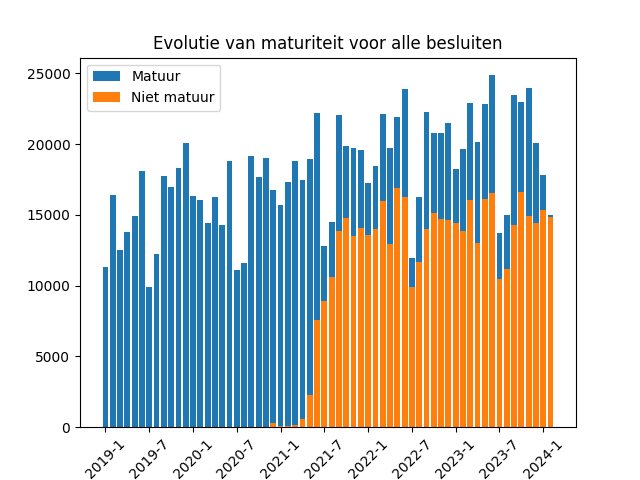
      </td>
      <td>
        
Raad van bestuur

        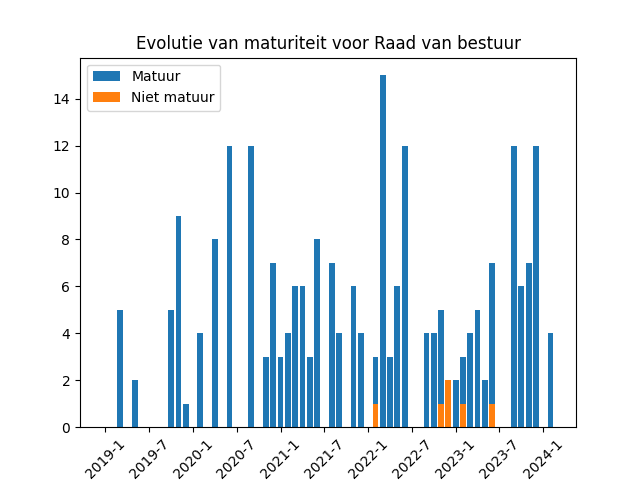
      </td>
    </tr>
    <tr>
      <td>
        
Bevoegd beslissingsorgaan

        
      </td>
      <td>
        
Adjunct-algemeen directeur

        
      </td>
    </tr>
    <tr>
      <td>
        
Regionaal bestuurscomité

        
      </td>
      <td>
        
Gouverneur

        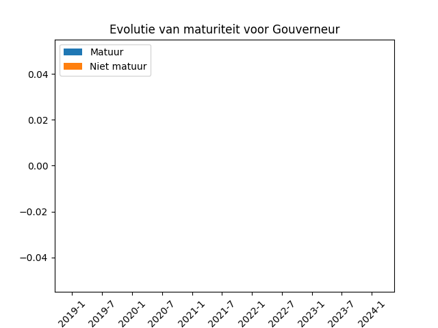
      </td>
    </tr>
    <tr>
      <td>
        
Politieraad

        
      </td>
      <td>
        
Algemeen directeur

        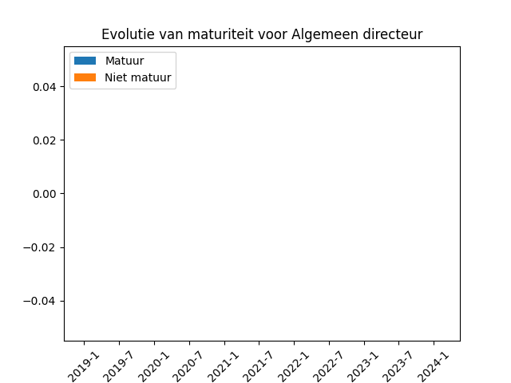
      </td>
    </tr>
    <tr>
      <td>
        
Financieel beheerder

        
      </td>
      <td>
        
Leidend Ambtenaar

        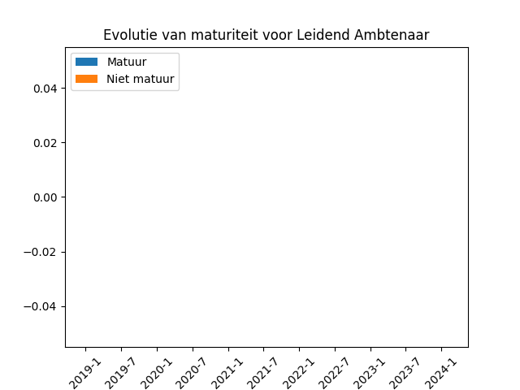
      </td>
    </tr>
    <tr>
      <td>
        
Burgemeester

        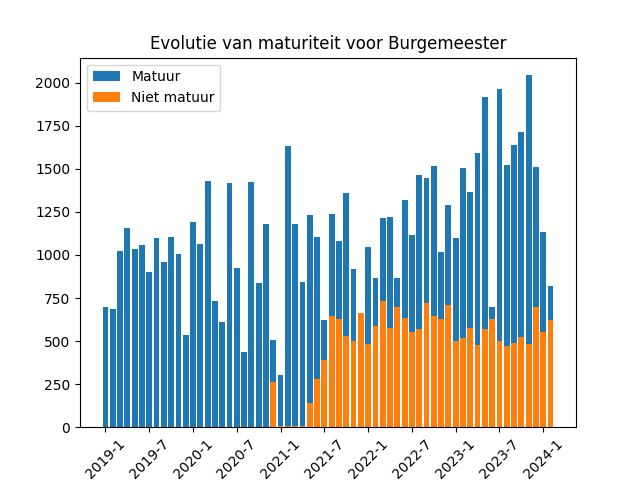
      </td>
      <td>
        
Voorzitter van de Gemeenteraad

        
      </td>
    </tr>
    <tr>
      <td>
        
Voorzitter van het Bijzonder Comité voor de Sociale Dienst

        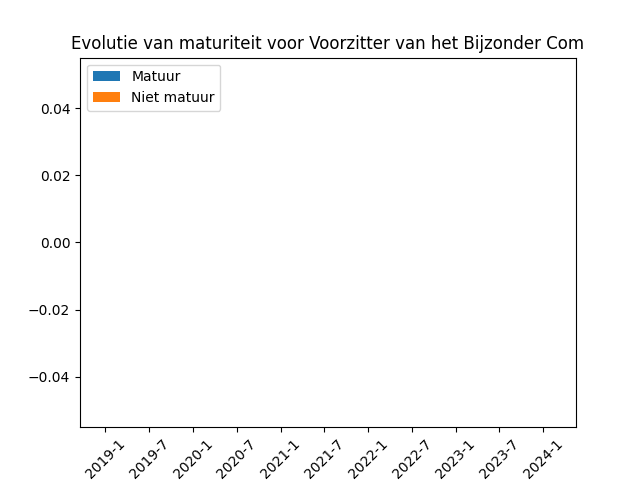
      </td>
      <td>
        
Directiecomité

        
      </td>
    </tr>
    <tr>
      <td>
        
Gemeenteraad

        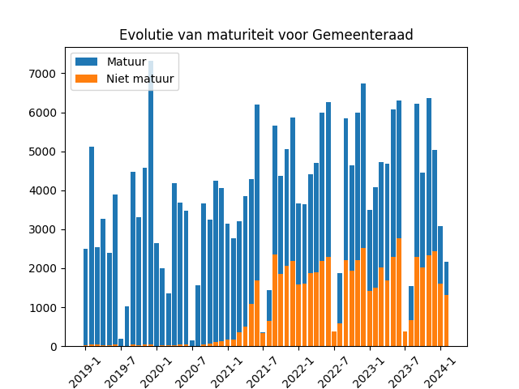
      </td>
      <td>
        
College van Burgemeester en Schepenen

        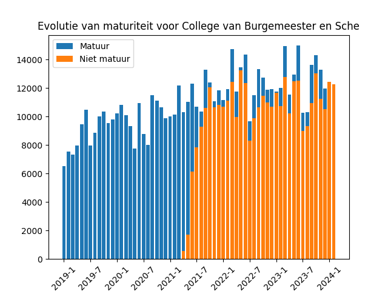
      </td>
    </tr>
    <tr>
      <td>
        
Raad voor Maatschappelijk Welzijn

        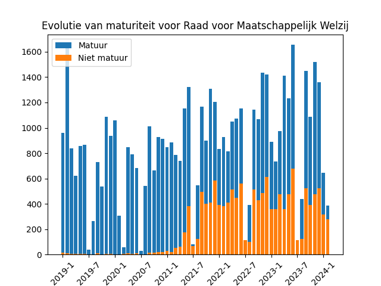
      </td>
      <td>
        
Vast Bureau

        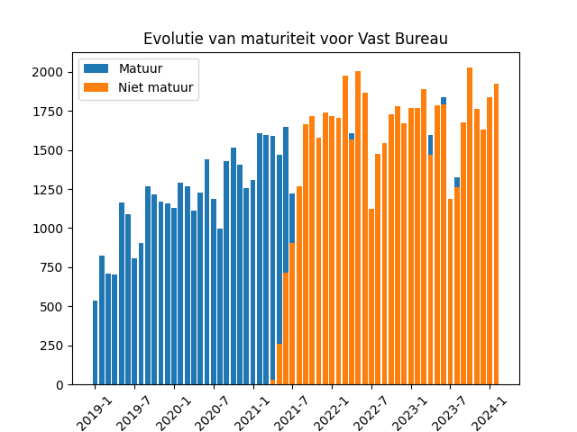
      </td>
    </tr>
    <tr>
      <td>
        
Bijzonder Comité voor de Sociale Dienst

        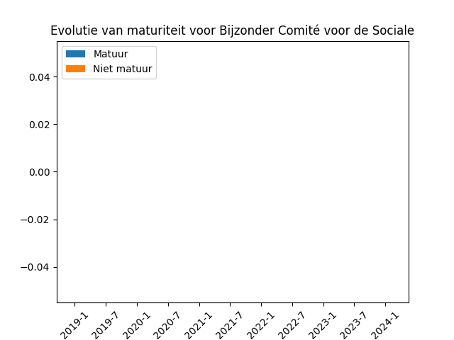
      </td>
      <td>
        
Districtsraad

        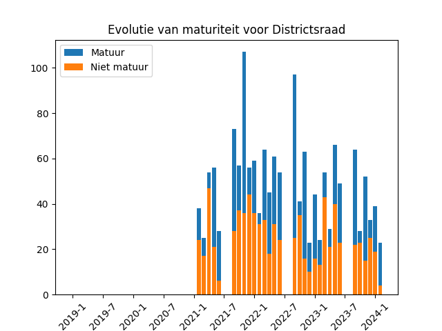
      </td>
    </tr>
    <tr>
      <td>
        
Districtscollege

        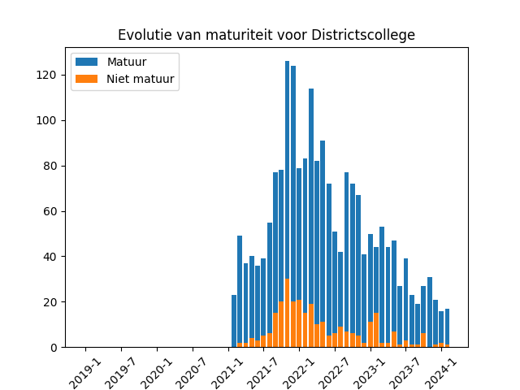
      </td>
      <td>
        
Provincieraad

        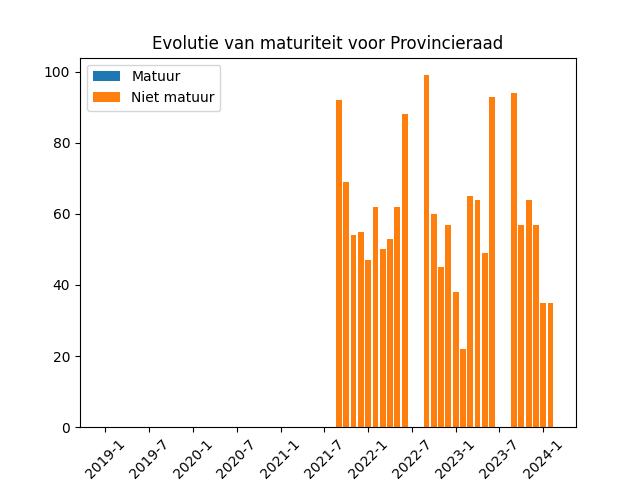
      </td>
    </tr>
    <tr>
      <td>
        
Deputatie

        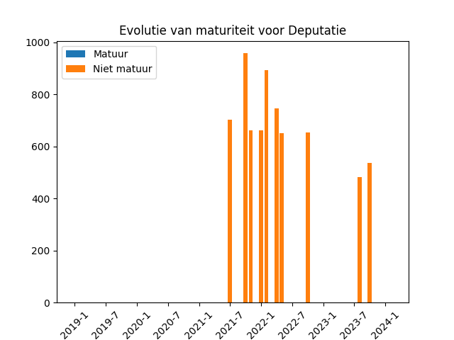
      </td>
      <td>
        
Griffier

        
      </td>
    </tr>
    <tr>
      <td>
        
Financieel directeur

        
      </td>
      <td>
        
Districtsburgemeester

        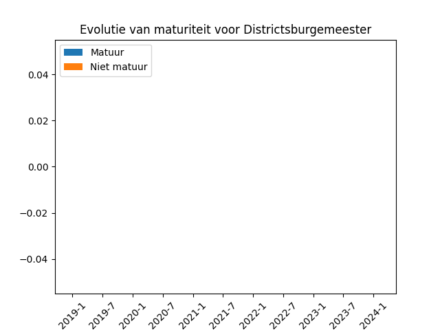
      </td>
    </tr>
    <tr>
      <td>
        
Zoneraad

        
      </td>
      <td>
        
Algemene vergadering

        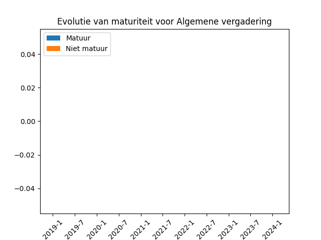
      </td>
    </tr>
    <tr>
      <td>
        
Voorzitter van de Raad voor Maatschappelijk Welzijn

        
      </td>
      <td>
        
Adjunct-financieel directeur

        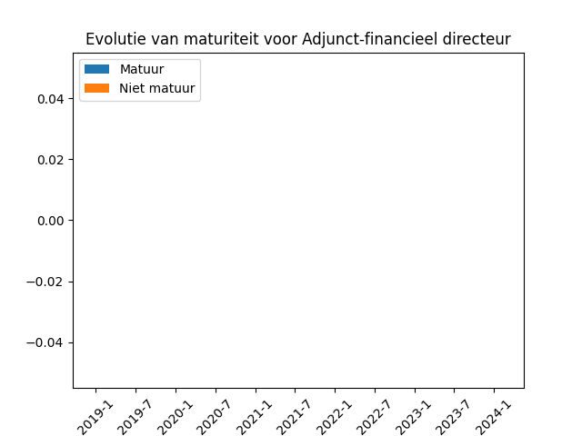
      </td>
    </tr>
    <tr>
      <td>
        
Kerkraad

        
      </td>
      <td>
        
Centraal kerkbestuur

        
      </td>
    </tr>
    <tr>
      <td>
        
Centraal bestuur

        
      </td>
      <td>
        
College

        
      </td>
    </tr>
    <tr>
      <td>
        
Bestuursraad

        
      </td>
      <td>
        
Kathedrale kerkraad

        
      </td>
    </tr>
    <tr>
      <td>
        
Kerkfabriekraad

        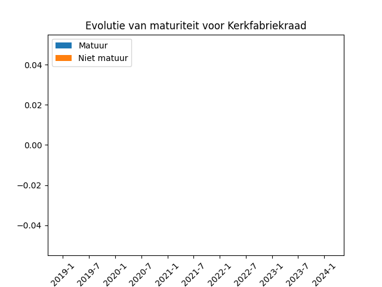
      </td>
      <td>
        
Comité

        
      </td>
    </tr>
    <tr>
      <td>
        
Collegelid

        
      </td>
    </tr>
  <tbody>
</table>

